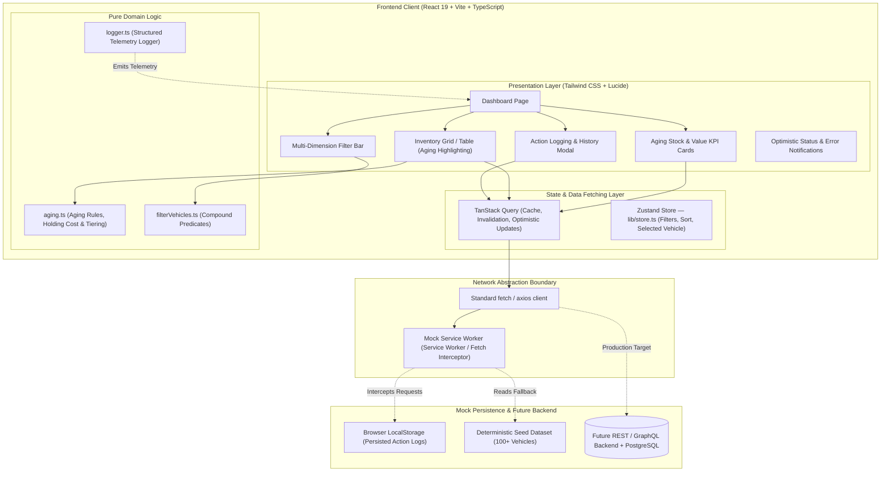
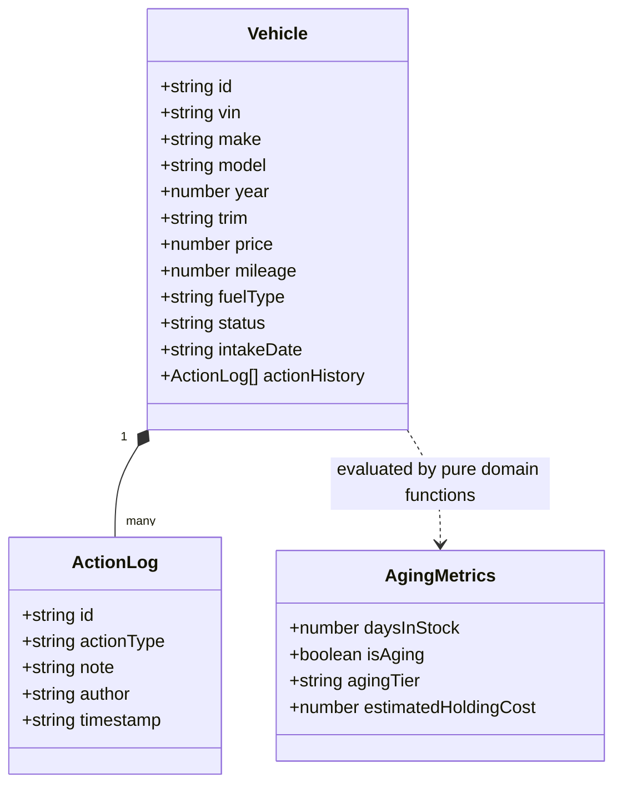
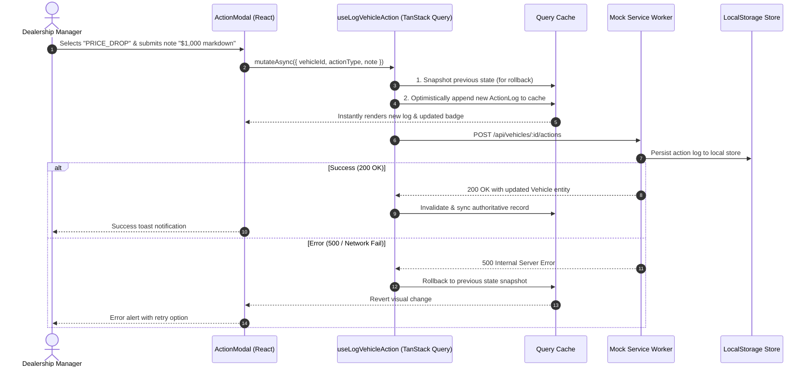
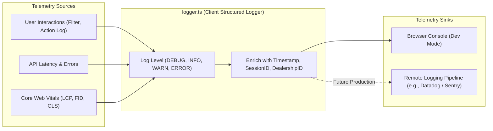

# System Design Document: Intelligent Inventory Dashboard

## 1. Executive Summary & Context
The **Intelligent Inventory Dashboard** is a supply-domain solution designed for automotive dealership general managers and inventory directors. It provides real-time visibility into vehicle stock, highlights capital depreciation risks caused by aging inventory (>90 days), and enables actionable decision logging with an append-only audit trail.

This document outlines the architecture, component boundaries, data flow, API contract, observability strategy, and future-readiness considerations for the solution.

---

## 2. Core Assumptions & Boundary Conditions

| Ambiguity | Stated Assumption | Engineering Rationale |
|---|---|---|
| **Dealership Scope** | Single dealership view for demo, with tenant scoping (`dealershipId`) built into domain models. | Supports multi-tenancy in future database schemas without breaking API contracts. |
| **Inventory "Age" Definition** | Measured as `days = floor((referenceDate - intakeDate) / 86,400,000)`. | Intake date represents when capital was committed; listing/publication date is prone to marketing resets. |
| **Aging Threshold** | Exactly $> 90$ days on lot. | Industry benchmark where floor-plan interest, depreciation, and holding costs escalate significantly. |
| **Status Logging** | Append-only history record (`status`, `note`, `managerId`, `timestamp`). | Managers need full audit trails of historical pricing decisions and wholesale reviews, not just current state. |
| **"Real-Time" Updates** | Optimistic UI updates with cache invalidation and background polling via TanStack Query. | True WebSockets are over-engineered for inventory updates that change on minute/hour scales. |
| **Authentication / RBAC** | Mocked session with role `INVENTORY_MANAGER`. | Documented for future OAuth2/OIDC integration with JWT role verification. |

---

## 3. High-Level Architecture

The frontend is built with **React 19 + TypeScript + Vite**, communicating with an isolated API layer abstracted via **Mock Service Worker (MSW)**. This establishes a clean architectural seam where replacing mock data with a production backend requires zero changes to business or presentation components.

---

## 4. Component Responsibilities & Boundaries

### Component Catalog

1. **`AgingStockBanner / KPICards`**:
   - Computes real-time summaries: Total Units, Total Capital at Risk, Aging Stock Count ($>90$ days), and Average Days on Lot.
   - Provides a quick 1-click trigger to isolate critical aging inventory.

2. **`FilterBar`**:
   - Compound filtering across Make, Model, Fuel Type, Price Range, Age Range, and Aging Status.
   - Debounced search input on VIN/Make/Model for responsive filtering without render thrashing.

3. **`InventoryTable`**:
   - Sortable columns with visual priority badges (`Healthy: <60d`, `Warning: 61-90d`, `Aging: 91-120d`, `Critical: >120d`).
   - Accessible keyboard navigation and row click-to-inspect actions.

4. **`StatusPanel / ActionModal`**:
   - Displays complete vehicle details alongside chronological audit history.
   - Allows logging actions (`PRICE_DROP`, `SEND_TO_AUCTION`, `WHOLESALE_TRANSFER`, `RECONDITIONING`, `MARKETING_BOOST`).
   - Executes optimistic updates with automatic rollback on network failure.

5. **`aging.ts` (Domain Core)**:
   - Pure, deterministic calculation functions (`getDaysInStock`, `isAgingStock`, `getAgingTier`, `calculateHoldingCost`).
   - Decoupled from `Date.now()` by accepting an optional reference date for testability.

---

## 5. End-to-End Data Flow

---

## 6. Technology Justifications

| Technology | Role | Justification |
|---|---|---|
| **React 19 + TypeScript** | UI & Type Safety | Strict contract validation, native transitions, compile-time type safety across API schemas. |
| **Vite** | Build Tooling | Sub-second HMR, instant cold start, optimized Rollup bundle configuration. |
| **Tailwind CSS + Radix/Lucide** | Styling & UI Primitives | Zero-runtime CSS overhead, accessible WAI-ARIA primitives, dark/light theme support. |
| **TanStack Query v5** | Server State Management | Out-of-the-box caching, deduplication, background polling, and declarative optimistic mutation rollbacks. |
| **Zustand** | Client UI State | Minimal, atomic store for filter/selection state; zero-boilerplate slice selectors prevent unnecessary re-renders from prop drilling. |
| **Mock Service Worker (MSW)** | API Mocking Seam | Intercepts requests at network level (Service Worker); allows 100% realistic `fetch` calls without coupling UI to mocks. |
| **Vitest + RTL** | Automated Testing | High-speed ESM-native test runner with JSDOM; identical matchers to Jest. |

---

## 7. Observability & Telemetry Strategy

Even in a frontend-focused service, production-grade observability is required:

1. **Structured Logging**: `lib/logger.ts` outputs JSON-structured events with event names (`vehicle.filter_applied`, `vehicle.action_logged`, `api.mutation_failed`), duration, and user context.
2. **Performance Monitoring**: Integration hook for Core Web Vitals (`onCLS`, `onFID`, `onLCP`) to identify render bottlenecks.
3. **Error Boundaries**: Root and component-level React error boundaries that capture unhandled runtime exceptions with breadcrumbs.

---

## 8. "Build for the Future" Scope Matrix

| Architectural Dimension | Implemented in Code (MVP) | Production Architecture (Documented Roadmap) |
|---|---|---|
| **Performance** | TanStack Query caching, client-side memoized filter indexes (`useMemo`). | TanStack Virtual for rendering 20,000+ items without DOM bloat; Edge CDN caching. |
| **Reliability** | Optimistic UI updates with snapshot rollback on 500 errors; Error Boundary. | Exponential backoff retry policies, offline IndexedDB sync queue via Workbox. |
| **Scalability** | Clean API seam via MSW with pagination query support (`?page=1&limit=25`). | Backend microservice with cursor-based pagination on indexed `(dealership_id, intake_date)` PostgreSQL tables. |
| **Maintainability** | Strict TypeScript interfaces derived from OpenAPI; pure domain helper functions. | Automated contract testing via Pact; shared npm/monorepo domain models package. |
| **Security & Auth** | Mock session context with manager roles. | OIDC / OAuth2 PKCE flow; backend RBAC validating JWT claims on mutation endpoints. |

---

## 9. GenAI Collaboration in System Design

During the design phase, Generative AI (Antigravity) was utilized strategically:
1. **Domain Modeling & Edge Case Discovery**: Prompted the AI to evaluate automotive inventory edge cases (e.g., inventory aging across leap years, vehicle transfers resetting intake dates vs. status logs).
2. **Contract-First Synthesis**: Co-designed the OpenAPI 3.0 specification (`docs/api-contract.yaml`) to ensure seamless synchronization between MSW mock handlers and frontend TypeScript types.
3. **Pragmatic Architecture Review**: Applied the **Ponytail (pragmatic/YAGNI)** and **Clean Code** principles to avoid over-engineering (e.g., electing TanStack Query polling over raw WebSocket infrastructure for this scale).
